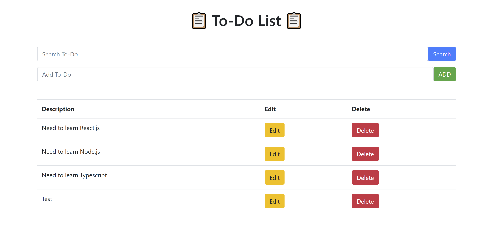
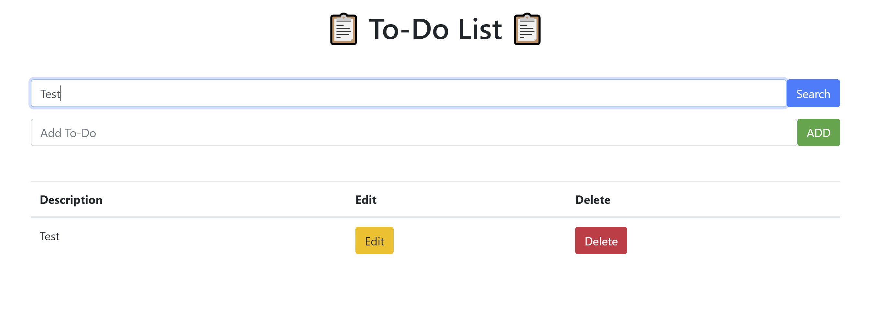

# To-Do List

***A simple application for managing your tasks! you can add, update and delete tasks!.***

## Instructions
##### 1. Clone ***( using `git clone` )*** or Download the folder ***( using ***`Download ZIP`*** option )*** #####
##### 2. Open your code editor and add the project folder #####
##### 3. Open two terminals and navigate one to the server and one to the frontend using ***`cd command`*** #####
##### 4. Install all required dependencies for both frontend&backend using ***`npm i`*** #####
##### 5. In the backend terminal type ***`npm start`*** to start the server #####
##### 6. In the frontend terminal type ***`npm start`*** to start the app #####

###### 📋 *Enjoy Detecting !!* 📋 ######

